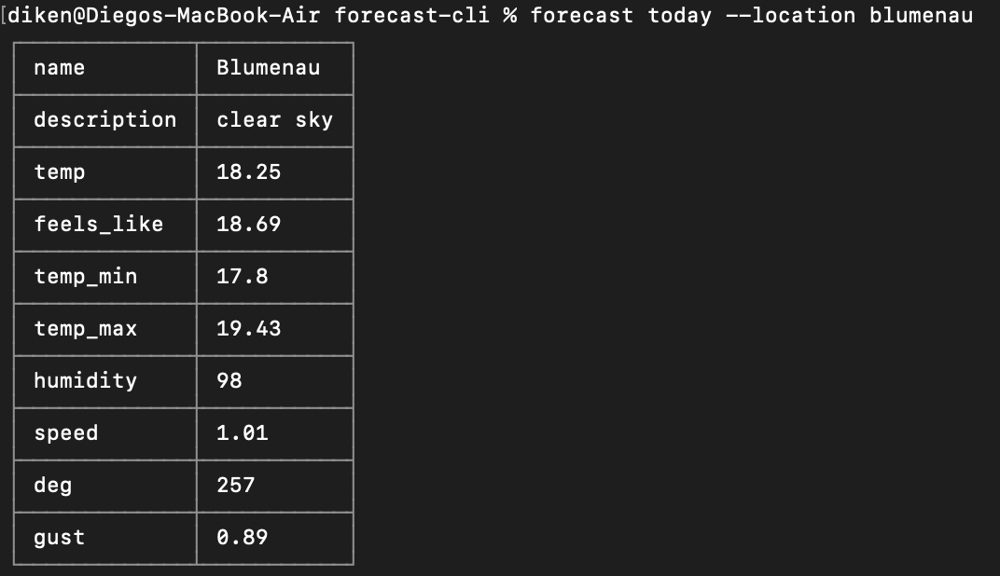

# CLi Weather App from Scratch

This project aims to build a Command-Line Interface (CLI) weather application from scratch to enhance understanding of CLI development and advanced data structures through the APIs it consumes.

## Objectives

The main objectives of this project are to:

1. Learn more about CLI development.
2. Gain proficiency in handling advanced data structures.
3. Integrate and consume various weather APIs.

## Principal Weather APIs

### OpenWeatherMap

- **Purpose**: To obtain the latitude and longitude of a selected city.
- **API Documentation**: [OpenWeatherMap API](https://openweathermap.org/api)

### Tomorrow.io

- **Purpose**: To get detailed weather information, including a 10-day forecast and current weather conditions.
- **API Documentation**: [Tomorrow.io API](https://app.tomorrow.io/signin)

## Main Dependencies

### minimist

- **Description**: A utility to parse argument options in a command-line environment.
- **Package URL**: [minimist on npm](https://npmjs.org/package/minimist)

### cli-table3

- **Description**: A utility that allows rendering of Unicode-aided tables on the command line from Node.js scripts.
- **Package URL**: [cli-table3 on npm](https://www.npmjs.com/package/cli-table3)

## Installation

To install the required dependencies, use the following commands:

```bash
npm install
```

To able to run on your machine, need to run:

```bash
npm link
```

```bash
forecast today --location blumenau
```

## To show the help menu

```bash
forecast help
```

    weather [command] <options>
    		today .............. show weather for today
    		forecast ........... show 10-day weather forecast
    		states ............. show list of states
    		version ............ show package version
    		help ............... show help menu for a command

## Help menu today

```bash
forecast help today
```

    weather today <options>
    		--location, -l ..... the location to use

## Example Result

<div align="center">
  
  <br/>
</div>

## Contributing

Contributions are welcome! Please open an issue or submit a pull request.

## License

This project is licensed under the MIT License.
